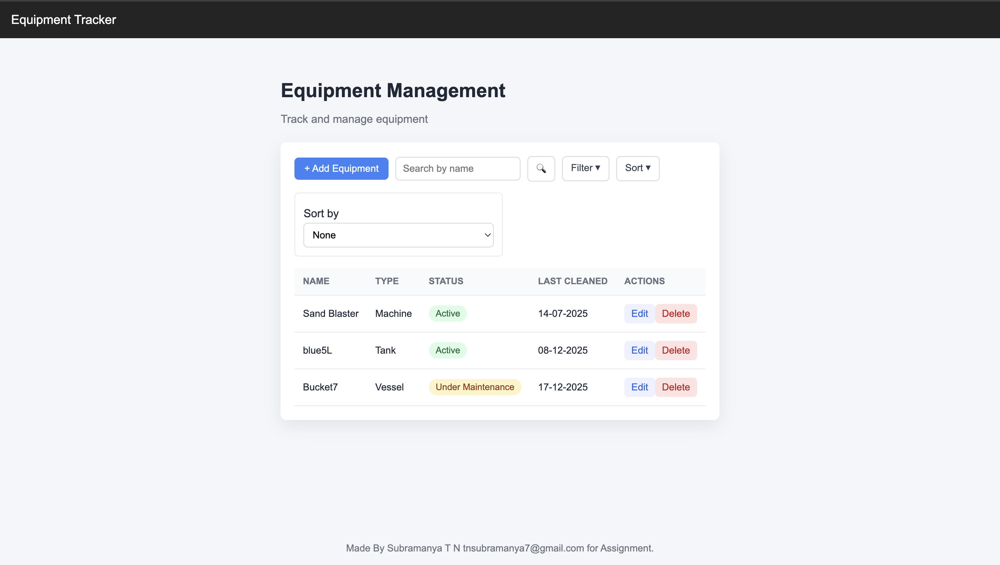

ReadME


# Equipment Tracker

```
Equipment Tracker is a simple full-stack web application to manage equipment records.

The goal of this project is to demonstrate:
- clean REST API design
- simple React frontend
- clear project structure
- readable, maintainable code

This project was built as a take-home assignment.

---

## Features

- View equipment list
- Add new equipment
- Edit existing equipment
- Delete equipment

Frontend will be added later.
```

That’s it.
No over-explanation. No marketing language.

---

# ✅ Backend README (`backend/README.md`)

```
# Backend

This folder contains the backend for the Equipment Tracker app.

It is built using:
- Node.js
- Express
- MySQL

### Frontend
- React (Vite)
- Plain CSS (no UI libraries)

---

## Project Structure

```

equipment-tracker/
  backend/     
  frontend/    
  README.md

```

---

## How to Run the Project

### 1. Start Backend
See the [Backend README](backend/README.md)

### 2. Start Frontend
See the [Frontend README](frontend/README.md)

---

## Notes

- Authentication is intentionally not included
- UI is intentionally simple
- Focus is on correctness and clarity over visual polish
```
## Future Improvements
The following features are planned but not implemented yet:

- Search equipment by name
- Filter equipment by type and status
- Sort equipment by name or last cleaned date
---


