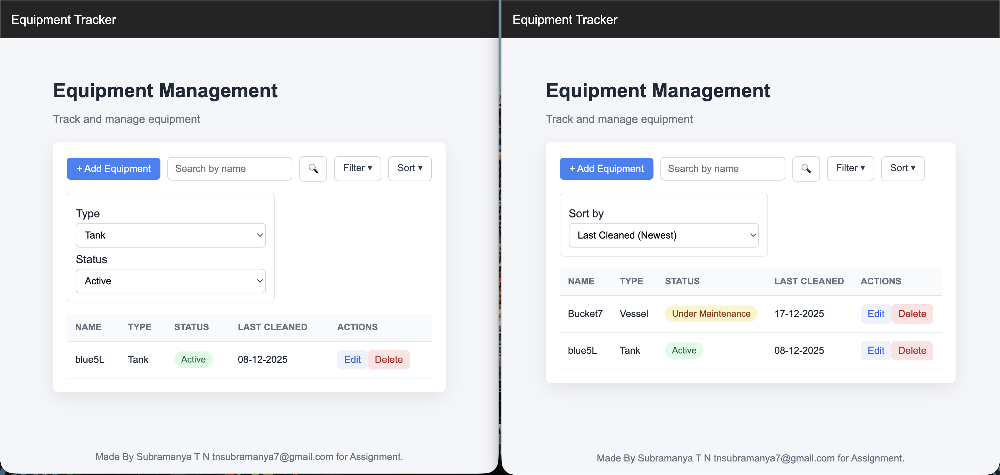

# Equipment Tracker


Equipment Tracker is a simple full-stack web application to manage equipment records.

The goal of this project is to demonstrate:
- clean REST API design
- simple React state management
- clear project structure
- readable and maintainable code

This project was built as a take-home assignment.

---

## Features

- View equipment list in a table
- Add new equipment
- Edit existing equipment
- Delete equipment
- Search equipment by name
- Filter equipment by type and status
- Sort equipment by name or last cleaned date
- pagination (yet to be implemented)

---

## Project Structure

```

equipment-tracker/
backend/     # Node.js + Express + MySQL
frontend/    # React (Vite) + plain CSS
README.md

```

---

## Running the Project

### Backend
See `backend/README.md`

### Frontend
See `frontend/README.md`
```
```
## Made by subramanya T N (tnsubramanya7@gmail.com / stn3086@gmail.com) 6363594637 for leucine as assignment 


