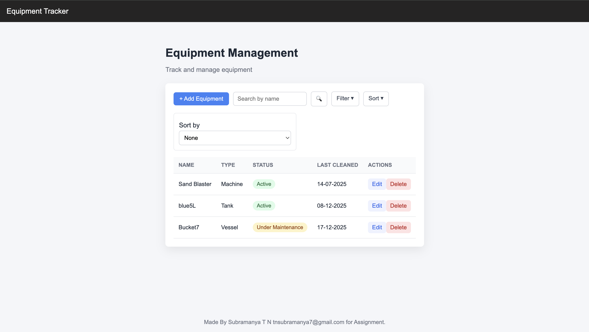
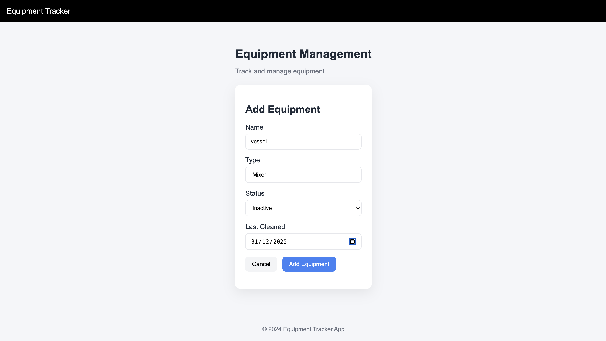

# FRONTEND README (`frontend/README.md`)






```
# Frontend – Equipment Tracker

This folder contains the React frontend for the Equipment Tracker application.

The frontend is a simple single-page application that communicates with the backend REST APIs.

---

## Features

- Display equipment list in a table
- Add new equipment
- Edit existing equipment
- Delete equipment
- Basic form validation
- Clean card-based UI

---

## Tech Used

- React (Vite)
- JavaScript
- Plain CSS
- Fetch API

No UI libraries or state management libraries are used.

---

## Project Structure

```

frontend/
├── src/
│   ├── App.jsx
│   ├── api.js
│   ├── index.css
│   ├── main.jsx
│   └── components/
│       ├── Header.jsx
│       ├── EquipmentTable.jsx
│       └── EquipmentForm.jsx
├── index.html
└── package.json

```

---

## How to Run Frontend

### Prerequisites
- Node.js installed
- Backend running on `http://localhost:5001`

### Steps

```

cd frontend
npm install
npm run dev

```

Vite will start the app on a local URL (usually `http://localhost:5173`).

---

## How Frontend Talks to Backend

All API calls are defined in `src/api.js`.

The frontend uses:
```

GET    /api/equipment
POST   /api/equipment
PUT    /api/equipment/:id
DELETE /api/equipment/:id

```

---

## Notes

- All state is managed locally using React hooks
- No routing is used since this is a small app
- UI focuses on clarity and usability
```

---
